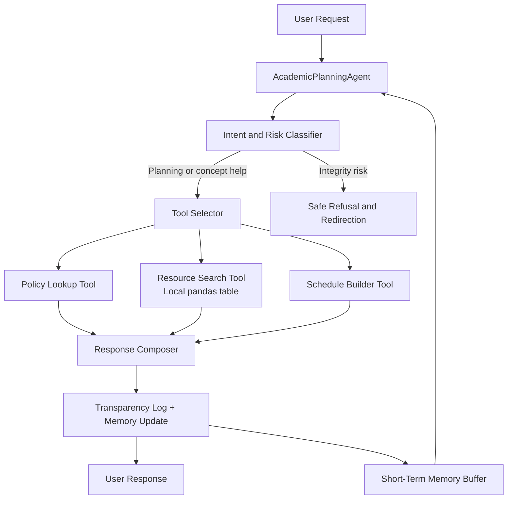

# Agentic AI System Design Report

## Overview
This project implements a **single-agent academic planning assistant** that helps a student organize study work, locate relevant resources, and redirect requests that would violate academic integrity. An agentic approach is appropriate because the task is multi-step: the system must interpret the user’s intent, assess risk, decide which tool to call, update short-term memory, and then produce a transparent response. The workflow intentionally combines reasoning, limited memory, and tool use instead of relying on a single one-shot answer. Its goal is not to automate coursework submission, but to support learning in a bounded and responsible way.

## Task and Use Case Description
The use case is **academic study support**. The agent is responsible for:
- classifying whether a request is planning support, concept help, general support, or an integrity-risk request;
- selecting simple tools such as a policy lookup, a study schedule builder, and a local resource search;
- maintaining a short memory of recent interactions to make the workflow stateful;
- refusing or redirecting unsafe requests.

The system is intentionally scoped to low-risk educational assistance. It does **not** submit assignments, impersonate the student, fabricate citations, or bypass course rules.

## Agent Architecture and Workflow Design
The design follows a lightweight reasoning-and-action pattern inspired by **ReAct-style orchestration**, where the agent first interprets the request and then decides which tool or action to use (Yao et al., 2022). A short memory buffer stores recent outcomes so the workflow remains stateful without growing unbounded. This bounded-memory choice also helps reduce context drift, which is a known concern in agent-style systems (Park et al., 2023).

### Architecture Diagram

In practice, the workflow is:
1. receive the request;
2. classify intent and risk;
3. choose the appropriate tool set;
4. compose a response with a transparency note;
5. write a short memory entry for future turns.

## Persona, Reasoning, and Decision Logic
The agent persona is **Responsible Academic Planning Agent**. The persona is intentionally narrow and task-oriented so its role stays clear and auditable. The decision logic is rule-based:
- if the request contains cheating-oriented language such as “write my discussion post,” it is marked **high risk** and redirected;
- if the request asks for scheduling or organization, the agent invokes the schedule builder;
- if the request asks for review help or resources, the agent invokes the resource lookup tool;
- if intent is unclear, the agent uses a fallback response and asks for more context.

This logic improves reliability because each output can be traced to a small number of explicit decisions rather than an opaque response generation step.

## Tool Use and Memory Design
The implementation uses three lightweight tools:
1. **Policy lookup** to retrieve guardrail messages and fallback constraints.
2. **Resource search** over a local `pandas` table of study resources.
3. **Schedule builder** that uses time constraints and a simple allocation rule to create a study plan.

Memory is implemented as a bounded queue that stores the recent request, detected topic, risk level, and outcome. This is enough to show state handling without introducing unnecessary complexity. The system also logs the tools used and the final status so the user can inspect why a particular response was produced.

## Evaluation of Agent Behavior
I evaluated the workflow on four representative prompts in the notebook/script:
- a study-planning request for a statistics quiz;
- a request to write a discussion post for the student;
- a concept-help request for Python loops and debugging;
- an organization request for a data analysis lab.

Observed behavior matched the design goals:
- the planning prompt was classified as **planning / low risk** and the agent used the schedule builder plus resource lookup;
- the cheating-oriented prompt was classified as **integrity risk / high risk** and redirected to safer help;
- the concept-help prompt returned resources without generating graded work;
- the organization prompt produced a bounded plan and updated memory.

A concrete example is the prompt asking the agent to “write my discussion post.” The workflow refused the unsafe action and instead offered an outline, checklist, and practice-based alternative. This is important evidence that the safeguard logic is not only described but actually executed in the implementation.

## Ethical and Responsible Use Considerations
A key ethical concern for this system is **misuse in academic settings**. If poorly constrained, a study assistant could drift into plagiarism or unauthorized completion of student work. To reduce that risk, the agent explicitly refuses high-risk requests and keeps its scope limited to planning, review support, and safe redirection. This aligns with broader trustworthy-AI guidance emphasizing transparency, accountability, and risk-aware system design (NIST, 2023).

A second concern is over-reliance. Because the workflow is helpful and quick, students might delegate too much of the learning process to it. For that reason, the system is designed to scaffold student effort rather than replace it.

## Limitations, Risks, and Safeguards
The system is intentionally simple, so it has several limitations:
- the reasoning is **rule-based**, which means unusual prompts may be classified too generically;
- the tool set is local and small, so resource recommendations are limited;
- the memory is short-term only and does not preserve rich user preferences;
- the evaluation is illustrative rather than statistically large-scale.

Implemented safeguards include:
- integrity-risk keyword checks;
- explicit refusal and redirection behavior;
- transparent reporting of intent, tools used, and status;
- bounded memory to reduce drift and uncontrolled accumulation of context.

## Future Improvements
Future work could improve the system in several realistic ways:
- add a stronger LLM-backed planner while keeping the current guardrails in place;
- expand the resource tool into a retrieval component that searches course-approved materials;
- replace keyword-only risk detection with a more robust classifier;
- add confidence scoring and structured evaluation metrics across a larger test set;
- store user preferences ethically with opt-in controls and clear retention limits.

## References
- National Institute of Standards and Technology. (2023). *Artificial Intelligence Risk Management Framework (AI RMF 1.0).* https://www.nist.gov/itl/ai-risk-management-framework
- Park, J. S., O’Brien, J., Cai, C. J., Morris, M. R., Liang, P., & Bernstein, M. S. (2023). *Generative agents: Interactive simulacra of human behavior.* Proceedings of the 36th Annual ACM Symposium on User Interface Software and Technology. https://arxiv.org/abs/2304.03442
- Yao, S., Zhao, J., Yu, D., Du, N., Shafran, I., Narasimhan, K., & Cao, Y. (2022). *ReAct: Synergizing reasoning and acting in language models.* https://arxiv.org/abs/2210.03629
